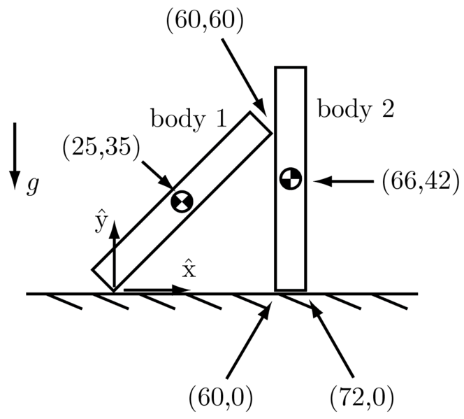
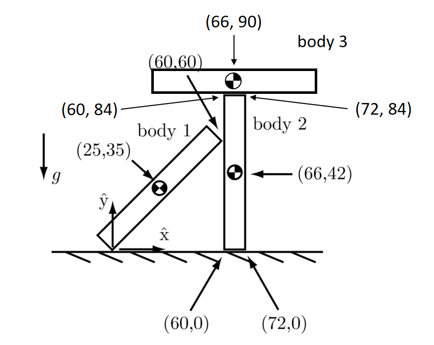
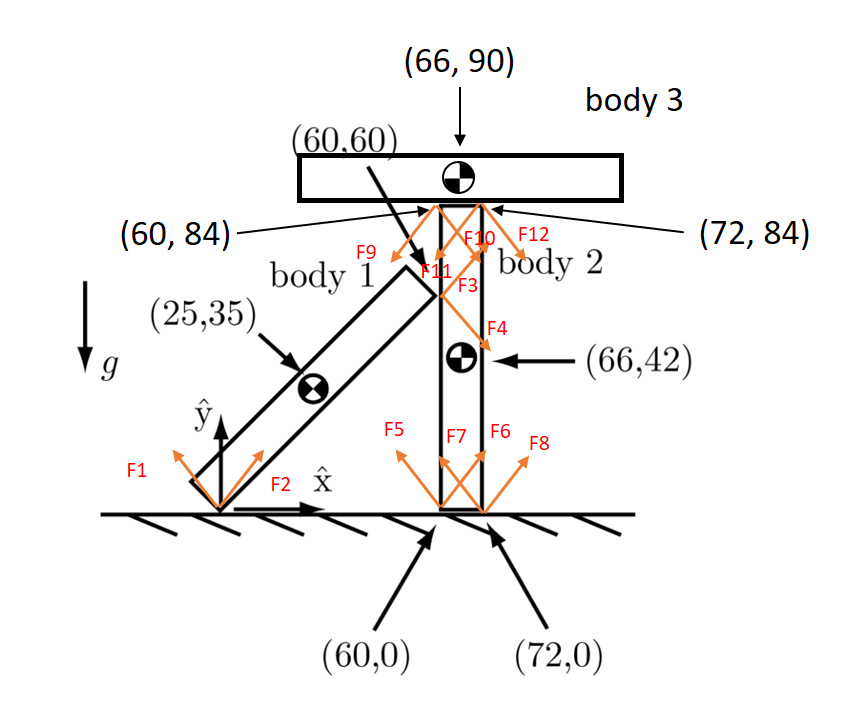
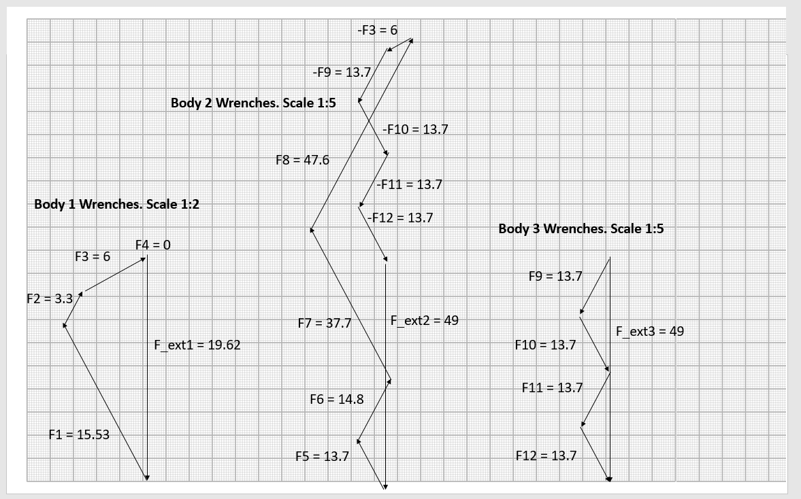

This program determines if an assembly of planar rigid bodies, in frictional contact with each other, can remain standing in gravity or if the assembly must collapse.

The program takes as input:
* a description of the static mass properties of each of the N bodies: the (x,y) location of the center of mass and the total mass in kg.
* a description of the contacts. Each contact consists of a list of the two bodies involved in the contact (0 means stationary ground); the (x,y) location of the contact; the contact normal direction into the first body involved in the contact; and the friction coefficient mu at the contact.
The output is binary: it is either possible or impossible for the assembly to remain standing. The solution method is linear programming that finds the contact vector k. This represents one set of contact forces that would keep the assembly standing.

## Example 1


```
Case 1
Bodies in this case are:
Body id, center of mass x, center of mass y, mass
1 25 35 2
2 66 42 5
Contacts in this case are:
Body id1, body id2, x, y, normal, mu
1 0 0 0 1.5707963267948966 0.1
1 2 60 60 3.141592653589793 0.5
2 0 60 0 1.5707963267948966 0.5
2 0 72 0 1.5707963267948966 0.5
The assembly collapsed
```
```
Case 2
Bodies in this case are:
Body id, center of mass x, center of mass y, mass
1 25 35 2
2 66 42 10
Contacts in this case are:
Body id1, body id2, x, y, normal, mu
1 0 0 0 1.5707963267948966 0.5
1 2 60 60 3.141592653589793 0.5
2 0 60 0 1.5707963267948966 0.5
2 0 72 0 1.5707963267948966 0.5
The assembly stands
Coefficients:  [15.538  3.351  6.093  0.    12.658 14.762 37.613 47.696  1.     1.   ]
```

## Example 2

```
Case 3
Bodies in this case are:
Body id, center of mass x, center of mass y, mass
1 25 35 2
2 66 42 5
3 66 90 5
Contacts in this case are:
Body id1, body id2, x, y, normal, mu
1 0 0 0 1.5707963267948966 0.4
1 2 60 60 3.141592653589793 0.5
2 0 60 0 1.5707963267948966 0.5
2 0 72 0 1.5707963267948966 0.5
2 3 60 84 -1.5707963267948966 0.5
2 3 72 84 -1.5707963267948966 0.5
The assembly collapsed
```
```
Case 4
Bodies in this case are:
Body id, center of mass x, center of mass y, mass
1 25 35 2
2 66 42 5
3 66 90 5
Contacts in this case are:
Body id1, body id2, x, y, normal, mu
1 0 0 0 1.5707963267948966 0.5
1 2 60 60 3.141592653589793 0.5
2 0 60 0 1.5707963267948966 0.5
2 0 72 0 1.5707963267948966 0.5
2 3 60 84 -1.5707963267948966 0.5
2 3 72 84 -1.5707963267948966 0.5
The assembly stands
Coefficients:  [15.538  3.351  6.093  0.    12.587 14.833 37.684 47.625 13.71  13.71 13.71  13.71   1.     1.     1.   ]
```
 
### Case 4 explanation


**sum of vector forces is equal to external forces**

